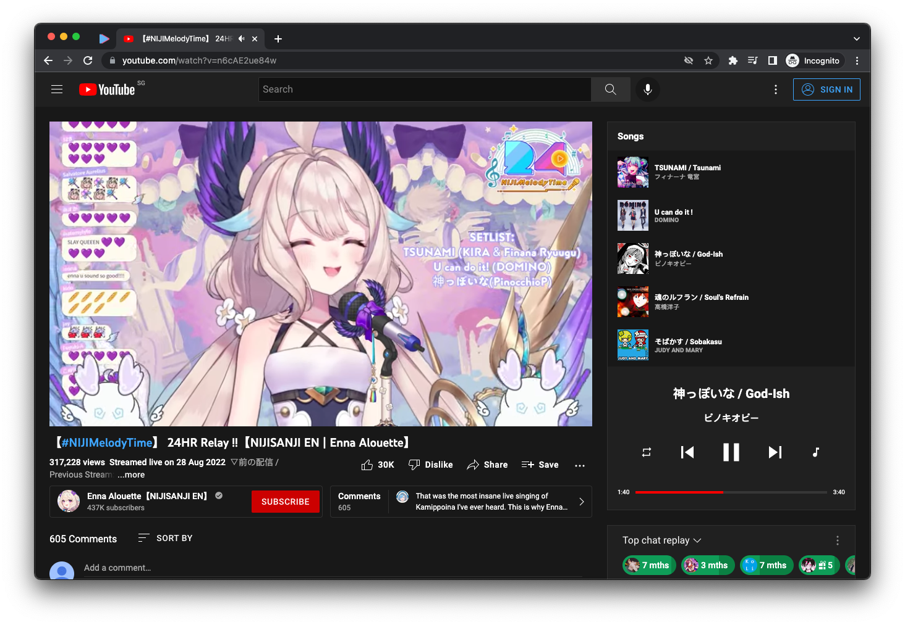

<div align="center">


# HoloSongs

[](https://github.com/themintchoco/holosongs/actions/workflows/release.yml)
[](https://github.com/themintchoco/holosongs/releases)
[](https://chrome.google.com/webstore/detail/holosongs/ipibfcnlipdkimfmajnddpboejkocplf)

</div>

Powered by the global Holodex community, HoloSongs (previously youtube-holodex) is a Chrome extension that adds a full featured media player to long YouTube livestreams so you can seek to your favorite songs and play them on repeat.



## Features

Get a full featured media player alongside singing streams

-  Setlist at a glance
-  Seek and skip individual songs
-  Repeat modes
-  Music mode (skips talking segments)

Works with most videos from your favorite streamers, including streamers from Hololive, Nijisanji and other organizations.

## Usage

To get started, retrieve your API key from your [account settings](https://holodex.net/login) and paste it into the extension settings.

## Installing

### Chrome Web Store

[](https://chrome.google.com/webstore/detail/holosongs/ipibfcnlipdkimfmajnddpboejkocplf)

The easiest method of installation. Simply click on the above image and then on *Add to Chrome*.

### Build from source

```bash
git clone git@github.com:themintchoco/holosongs.git
cd holosongs

npm install
npm run build
```

To complete installation, enable developer mode on the Chrome extensions page and click *Load Unpacked*. Then select the `dist/` directory created during the build.
